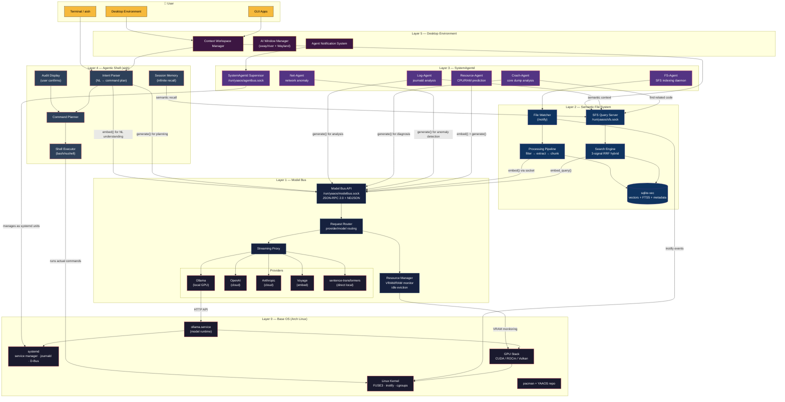
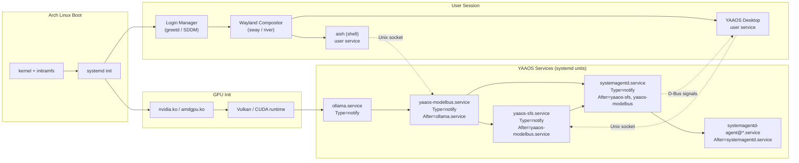
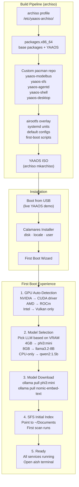

# YAAOS Architecture Overview

**Status:** Approved
**Last Updated:** 2026-03-15
**Project:** YAAOS (Your Agentic AI Operating System)

---

## 1. High-Level Architecture

YAAOS is structured as a layered system where AI agents are integrated at every level of the OS stack, from the filesystem up to the desktop environment. Each layer can function independently, enabling incremental development and adoption.

```
┌─────────────────────────────────────────────────────┐
│                  Desktop Environment                │
│         (Dynamic Context Workspaces / DE)           │
├─────────────────────────────────────────────────────┤
│               Agentic Shell (aish)                  │
│        (Intent-driven, LLM-powered shell)           │
├─────────────────────────────────────────────────────┤
│              SystemAgentd (Agent Bus)               │
│   ┌──────────┬──────────┬──────────┬──────────┐     │
│   │Net-Agent │Crash-Agt │Res-Agent │Log-Agent │     │
│   └──────────┴──────────┴──────────┴──────────┘     │
├─────────────────────────────────────────────────────┤
│         Semantic File System (SFS / LSFS)           │
│   ┌──────────────────────────────────────────┐      │
│   │  FUSE Layer ←→ Embedding Engine ←→ VecDB │      │
│   └──────────────────────────────────────────┘      │
├─────────────────────────────────────────────────────┤
│            AI Runtime Layer (Model Bus)             │
│   ┌──────────────────────────────────────────┐      │
│   │  Ollama / llama.cpp  ←→  Model Registry  │      │
│   │  (Local SLMs + Pluggable Cloud Providers)│      │
│   └──────────────────────────────────────────┘      │
├─────────────────────────────────────────────────────┤
│              Base OS (Arch Linux)                   │
│        systemd · pacman · Linux Kernel · GPU        │
└─────────────────────────────────────────────────────┘
```

---

## 2. Layer Breakdown

### Layer 0: Base OS (Arch Linux)

The foundation. A minimal Arch Linux install providing:
- **Linux kernel** with FUSE3 support
- **systemd** as the init system and agent supervisor
- **pacman** + custom YAAOS repo for package management
- **GPU drivers**: Vulkan (default), NVIDIA CUDA / AMD ROCm (optional, auto-detected)
- **Core utils**: standard GNU/Linux userland

Why Arch: Rolling release ensures latest AI tooling, AUR provides the long tail of packages, `archiso` is proven for building derivative distros, minimal base means no bloat to strip.

### Layer 1: AI Runtime Layer (Model Bus)

A unified interface for all AI inference in the system. Every component that needs AI goes through this layer.

```
┌─────────────────────────────────────────┐
│             Model Bus API               │
│  (Unix socket: /run/yaaos/modelbus.sock)│
├─────────────┬───────────────────────────┤
│  Embedding  │     Generation            │
│  endpoint   │     endpoint              │
├─────────────┴───────────────────────────┤
│           Provider Router               │
│  ┌─────────┐ ┌─────────┐ ┌───────────┐  │
│  │ Ollama  │ │ OpenAI  │ │ Anthropic │  │
│  │ (local) │ │ (cloud) │ │  (cloud)  │  │
│  └─────────┘ └─────────┘ └───────────┘  │
└─────────────────────────────────────────┘
```

**Status:** Implemented (`yaaos-modelbus` v0.1.0, 173 tests)

Key design decisions:
- **Transport**: asyncio Unix socket + NDJSON framing + JSON-RPC 2.0 protocol. Human-debuggable, no HTTP overhead.
- **5 pluggable providers**: Ollama (local, default), OpenAI (cloud), Anthropic (cloud), Voyage (embeddings), local sentence-transformers. Configured via `~/.config/yaaos/modelbus.toml` + `.env` for API keys.
- **Swappable models**: Components request by capability (embed/generate/chat). Model strings use `provider/model` convention (e.g., `ollama/nomic-embed-text`). The router resolves defaults.
- **Resource-aware**: VRAM/RAM monitoring via pynvml + psutil. LRU eviction when capacity is low. Idle timeout unloads unused models. Capacity pre-checks before loading.
- **Streaming**: First-class streaming generation with back-pressure. JSON-RPC notifications for chunks, final response with usage stats.
- **Python SDK**: Sync + async client (`ModelBusClient`, `AsyncModelBusClient`) with timeouts and error handling.
- **CLI**: `yaaos-bus` — health, models, embed, generate, config get/set.
- **Hot-reload**: `config.reload` JSON-RPC method — atomic provider swap with zero downtime.

### Layer 2: Semantic File System (SFS)

The memory layer of YAAOS. SFS watches a directory, understands file *content* and *meaning*, and provides semantic search to every component above it.

```
Files created/modified in ~/semantic/
        │
        ▼
┌──────────────┐      ┌─────────────────┐      ┌──────────────┐
│  File Watcher│────> │ Processing      │────> │  sqlite-vec  │
│  (watchdog)  │      │ Pipeline        │      │  (vectors +  │
│              │      │  1. Filter      │      │   FTS5 +     │
│              │      │  2. Extract     │      │   metadata)  │
│              │      │  3. Chunk       │      │              │
│              │      │  4. Embed (GPU) │      │              │
└──────────────┘      └─────────────────┘      └──────────────┘
                                                      │
┌──────────────┐      ┌──────────────────┐            │
│   CLI Tool   │────> │  Search Engine   │<───────────┘
│  `yaaos-find`│      │  3-signal RRF:   │
│              │      │  vector+kw+path  │
│  Daemon Query│────> │  + recency boost │
│  Server :9749│      │                  │
└──────────────┘      └──────────────────┘
```

Architecture (v2 — current):
- **4-layer file filtering**: Hardcoded ignores → .gitignore/.sfsignore → extension whitelist → size limit. Removes ~95% of noise before indexing.
- **3-tier processing**: Text-native files (code, markdown) → rich documents (PDF, DOCX, PPTX, XLSX, EPUB) → media metadata (EXIF, audio tags, video info).
- **Smart chunking**: Tree-sitter AST-aware chunking for code (functions/classes as units), section-aware for docs, fixed-size fallback.
- **Stat-first change detection**: mtime_ns + size_bytes comparison, xxHash128 fallback — 60-100x faster than SHA-256.
- **3-signal hybrid search**: Vector similarity + FTS5 keyword + path matching, merged via RRF with recency boost.
- **GPU acceleration**: Auto-detects CUDA/MPS/CPU, adaptive batch sizing (64 GPU, 32 CPU).
- **Daemon query server**: Localhost HTTP server for instant CLI searches without cold-starting the embedding model.

### Layer 3: SystemAgentd (Agent Bus)

The agent orchestration layer, built on top of systemd.

```
┌─────────────────────────────────────────────┐
│            SystemAgentd Supervisor          │
│  (systemagentd.service — Rust/Python daemon)│
│                                             │
│  Config: /etc/yaaos/agents.toml             │
│  API:    /run/yaaos/agentbus.sock           │
├─────────────────────────────────────────────┤
│  Manages agents as systemd service units:   │
│                                             │
│  systemagentd-agent@net.service             │
│    → Network anomaly detection              │
│    → Type=notify, WatchdogSec=30            │
│                                             │
│  systemagentd-agent@crash.service           │
│    → Core dump analysis                     │
│    → Socket-activated (on-demand)           │
│                                             │
│  systemagentd-agent@resource.service        │
│    → CPU/RAM/GPU prediction & scheduling    │
│    → Type=notify, CPUQuota=10%              │
│                                             │
│  systemagentd-agent@log.service             │
│    → Real-time journald analysis            │
│    → Type=simple, reads journal stream      │
│                                             │
│  systemagentd-agent@fs.service              │
│    → Semantic FS indexing daemon            │
│    → Type=notify                            │
└─────────────────────────────────────────────┘
```

Built on systemd because it provides for free:
- **cgroups** for resource isolation per agent
- **journald** for structured logging
- **D-Bus** for inter-agent communication
- **Socket activation** for on-demand agents
- **Watchdog** for automatic crash recovery
- **Service templates** (`agent@.service`) for uniform management

### Layer 4: Agentic Shell (aish)

The user-facing shell that understands intent, not just commands.

```
User input: "compress python files and send to staging"
        │
        ▼
┌──────────────────┐
│   Intent Parser  │ ←── Model Bus (LLM)
│   (NL → plan)    │
├──────────────────┤
│  Command Planner │
│  (plan → cmds)   │
├──────────────────┤
│  Audit Display   │  ←── Shows generated commands
│  (user confirms) │      before execution
├──────────────────┤
│  Executor        │
│  (runs commands) │
└──────────────────┘
```

Built on top of an existing shell (Nushell or bash) with an LLM intent layer. Falls back to standard shell behavior for normal commands.

### Layer 5: Desktop Environment

Context-driven workspaces managed by AI. Future scope -- not part of MVP.

---

## 3. Inter-Component Communication

All YAAOS components communicate via Unix domain sockets:

| Socket | Purpose |
|--------|---------|
| `/run/yaaos/modelbus.sock` | AI inference requests (embed, generate) |
| `/run/yaaos/agentbus.sock` | Agent management API |
| `/run/yaaos/sfs.sock` | Semantic FS search queries |
| systemd D-Bus | Agent lifecycle, system events |

Data format: JSON-RPC 2.0 over Unix sockets for simplicity and debuggability.

---

## 4. Data Flow Example: File Save → Semantic Search

```
1. User saves "meeting_notes.md" into ~/semantic/

2. inotify detects the write event

3. Indexing daemon:
   a. Reads file content
   b. Extracts text (trivial for .md)
   c. Chunks into segments (if large)
   d. Calls Model Bus: POST /embed {text: "..."}
   e. Model Bus routes to Ollama → all-MiniLM-L6-v2
   f. Returns 384-dim vector

4. Stores in sqlite-vec:
   - file_path, file_hash, mtime, size (metadata)
   - chunk_text, chunk_index (content)
   - embedding vector (384 dims)

5. Later, user runs:
   $ yaaos-find "what did we discuss about the API redesign?"

6. Search engine:
   a. Embeds the query via Model Bus
   b. Runs sqlite-vec nearest-neighbor search
   c. Also runs FTS5 keyword search
   d. Merges results (RRF fusion)
   e. Returns ranked file list with snippets
```

---

## 5. SFS: The Memory Layer

SFS is not just a file search tool — it is the **semantic memory layer** that every higher layer depends on for context-aware intelligence. Without SFS, agents are blind, the shell is dumb, and the desktop can't organize anything.

### How Each Layer Consumes SFS

| Layer | How It Uses SFS | Example |
|-------|----------------|---------|
| **Model Bus** | SFS is the **context provider** for all AI calls. When any component needs relevant context for a prompt, it queries SFS — OS-level RAG. | Model Bus answering "explain this error" pulls related source files + docs via SFS |
| **SystemAgentd** | Agents use SFS to **understand the workspace**. An agent assigned a task discovers all relevant files, dependencies, and docs without the user listing them. | Refactor-Agent queries SFS for "payment module" → finds all related files across the codebase |
| **Agentic Shell** | SFS replaces `find`, `grep`, `locate` with **intent-based search**. Natural language resolves to actual files. | `"open everything related to the login flow"` → SFS returns auth controllers, middleware, tests, docs |
| **Desktop Environment** | SFS powers **context workspaces** — the desktop auto-organizes around what you're working on by surfacing semantically related files. | Open a Kubernetes PDF → SFS auto-surfaces your YAML configs, Dockerfiles, and deployment notes |

### What Makes SFS Different from Traditional Search

| | Traditional (Spotlight/Windows Search) | SFS |
|---|---|---|
| **Indexing** | Filename + keyword extraction | Semantic embeddings — understands *meaning* |
| **Query** | Exact keyword match | Natural language: "that auth bug I fixed last week" |
| **Scope** | Files only | Files + code functions + document sections + media metadata |
| **Intelligence** | Static index | 3-signal hybrid (vector + keyword + path) with recency boost |
| **Integration** | Standalone search bar | Foundation layer consumed by every YAAOS component |

---

## 6. Full System Integration (Mermaid)

### How Every Layer Connects



### systemd Service Dependency Chain (Boot Order)



### Arch Linux ISO Integration (Phase 6)

How all of this becomes a bootable OS:



### YAAOS Package Structure (pacman)

Each YAAOS layer ships as a separate pacman package with proper dependency chains:

```
yaaos-base          (metapackage — pulls everything)
├── yaaos-modelbus  (Model Bus daemon + CLI + providers)
│   ├── ollama      (from AUR/community)
│   └── python-httpx, python-pynvml, ...
├── yaaos-sfs       (Semantic File System daemon + CLI)
│   ├── yaaos-modelbus  (for embed via Bus)
│   └── python-sentence-transformers, sqlite-vec, ...
├── yaaos-agentd    (SystemAgentd + built-in agents)
│   ├── yaaos-modelbus
│   └── yaaos-sfs
├── yaaos-shell     (aish — Agentic Shell)
│   ├── yaaos-modelbus
│   ├── yaaos-sfs
│   └── nushell (base shell)
└── yaaos-desktop   (Desktop Environment)
    ├── yaaos-shell
    ├── yaaos-agentd
    └── sway / river (Wayland compositor)
```

Each package includes its own systemd unit files, default configs in `/etc/yaaos/`, and is independently installable. A user could run `pacman -S yaaos-sfs yaaos-modelbus` on any existing Arch install to get just the semantic FS + model bus without the full DE.

---

## 7. Development Phases

| Phase | Component | pacman Package | Deliverable | Status |
|-------|-----------|---------------|------------|--------|
| **Phase 1** | Semantic File System | `yaaos-sfs` | Daemon + indexing + CLI search | Done |
| **Phase 1.5** | SFS v2 | `yaaos-sfs` | Multi-format, smart chunking, GPU, 136 tests | Done |
| **Phase 2** | Model Bus | `yaaos-modelbus` | Unified AI runtime, pluggable providers, VRAM mgmt | Planned |
| **Phase 3** | SystemAgentd | `yaaos-agentd` | Agent supervisor + first agents | Planned |
| **Phase 4** | Agentic Shell | `yaaos-shell` | Intent-driven shell prototype | Planned |
| **Phase 5** | Desktop Environment | `yaaos-desktop` | Context-driven workspaces | Planned |
| **Phase 6** | Distro | `yaaos-base` | archiso build → bootable ISO | Planned |
