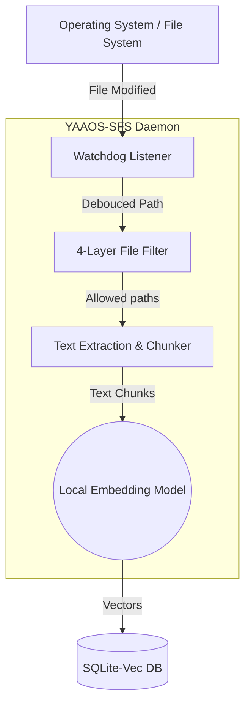
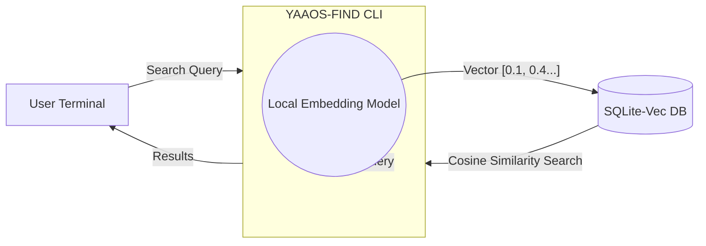

# YAAOS Semantic File System (SFS) Architecture

The YAAOS Semantic File System is designed to be highly self-contained, lightweight, and entirely local by default.

This document clarifies what components exist, where they run, and how they interact with each other.

---

## 🏗️ High-Level Architecture

SFS consists of two main programs, both of which you run, and two main "dependencies" which are fully embedded within those programs (no distinct background services required).

### 1. The Core Programs (The "What you run" part)

1. **The Daemon (`yaaos-sfs`)**
   - **What it is:** A long-running Python background process.
   - **When to invoke:** You run it once in a terminal using `uv run yaaos-sfs` and leave it running in the background.
   - **What it does:** It performs an initial scan of your directory, then listens to local file system events (File Created, File Modified, File Deleted) using the `watchdog` library. When a file is modified, it extracts the text, breaks it into chunks, embeds those chunks into vectors, and saves them to the database.

2. **The Finder CLI (`yaaos-find`)**
   - **What it is:** A short-lived terminal command.
   - **When to invoke:** You run it whenever you want to search your codebase. (e.g., `uv run yaaos-find "Where is the file filtering logic?"`).
   - **What it does:** It takes your search query, converts it into a vector embedding, and asks the database for the most semantically similar chunks of code. It prints the results and quickly exits.

---

### 2. The Core Technologies (The "Where does it run" part)

A common point of confusion is over things like the "Database" or the "AI Model". **In YAAOS SFS, everything is embedded locally in the Python process.** There are *no* external standalone servers running on separate ports.

1. **The Database (`sqlite-vec`)**
   - **Where it runs:** It runs inside the Python process of whoever calls it. There is **no separate SQL server** (like PostgreSQL or MySQL) running in the background.
   - **How it works:** `sqlite-vec` acts exactly like standard SQLite but with vector math support. It reads and writes directly to a file stored locally on your disk (usually around `~/.local/share/yaaos/sfs.db`). 
   - Both the Daemon and the Finder CLI access this exact same file directly.

2. **The Local Embedding Model (`sentence-transformers`)**
   - **Where it runs:** It is downloaded to your local `.cache/huggingface` folder the first time you run YAAOS, and from then on it runs completely locally using your CPU (or GPU if configured).
   - **How it works:** When the Daemon (`yaaos-sfs`) starts, it loads the model into its memory to embed files. Similarly, when the Finder (`yaaos-find`) is executed, it loads the model into its memory to embed your search query. 
   - *Note: You can opt out of the local model by configuring the `openai` provider, which will send text over the network to OpenAI APIs instead.*

---

## 🗺️ Component Flow Diagrams

### SFS Daemon (Background Watcher) Flow

### Search CLI Flow

---

## 🔄 The Interaction Lifecycle (When everything happens)

Let's trace a practical example:

1. **Starting Up (& Restarting):** You run `uv run yaaos-sfs`.
   - The Python process starts.
   - It directly creates/opens the local SQLite file on your disk.
   - It loads the `sentence-transformers` embedding model into your machine's RAM.
   - **Incremental Re-indexing:** It runs an "Initial Scan" over your directory. Instead of re-embedding everything blind, it compares file modification times on the disk against the timestamps stored in the SQLite DB. SFS *only* chunks and embeds files that are **new** or have been **modified** since the daemon was last shut down. Files that haven't changed are instantly skipped.
   - It begins actively watching your files.

2. **Editing Code:** You edit `filter.py` and hit "Save".
   - The OS triggers a file-write event.
   - The `watchdog` inside the Daemon notices the change and pauses for 1.5 seconds (debouncing, in case you save multiple times in a row).
   - The Daemon reads `filter.py`, chunks the text.
   - The Daemon runs the text chunks through the Local Model in RAM to get vectors.
   - The Daemon saves those vectors into the SQLite DB file.

3. **Searching:** In a separate terminal, you run `uv run yaaos-find "How does the filter work?"`
   - A *new* Python process spawns.
   - It loads the Local Model into its RAM, and embeds your question into a vector.
   - It opens the *exact same* SQLite DB file the Daemon is actively writing to.
   - It runs a fast nearest-neighbor SQL query to find the chunks that closely match your question vector.
   - It prints the results and the process shuts down, freeing up its RAM.

---

## 🐧 Future OS Integration (How will this work on YAAOS?)

When YAAOS ships as a full Linux distribution, you won't be manually starting SFS in a terminal. 

1. **Systemd Service:** SFS will run as a native background `systemd` service (`systemctl enable yaaos-sfs`). It will boot up invisibly alongside the Linux kernel/UI.
2. **Binary Compilation:** While written in Python, for the final OS release we will likely compile the application using tools like `Nuitka` or `PyInstaller`. This turns the Python scripts into heavily optimized standalone C/C++ executables, drastically reducing CPU/RAM overhead on the system compared to spinning up a virtual environment.
3. **IDE Integration:** Your code editors (like VS Code SSH) and Terminal AI bots will directly ping the `yaaos-find` executable behind the scenes.

---

## 📊 Scale & Resource Utilization Estimates (Real World Example)

*Individual folder metrics below are derived from real-world data using the `tools/stats/calc_stats_win.py` utility.*

To understand how aggressively SFS optimizes itself, let's look at a real-world scan of a **21.5 GB workspace** (containing 225,000 files):

| Metric | Size | File Count | Percentage |
| :--- | ---: | ---: | ---: |
| **Total Discovered Data** | 21.51 GB | 225,208 | 100.0% |
| **Ignored Data (Pruned)** | 21.46 GB | 222,139 | 99.8% |
| **Indexed Data** | 50.19 MB | 3,069 | 0.2% |

### 1. Phase 1: Pruning the Noise (The Filter)
- **Time:** Blazing Fast (4 seconds).
- **RAM:** Nominal (<50 MB).
- **What Happens:** The 4-layer Python filter instantly identifies that **99.8% of the workspace** is noise (`.git`, `node_modules`, binaries) and skips it entirely. Out of 21.5 GB, only **50 MB** of actual text source code survives. 

### 2. Phase 2: Indexing the Source Code
- **Time:** Fast (Minutes). Embedding 50 MB of text requires breaking it down into roughly 100,000 chunks. On a CPU this takes a few minutes. On a GPU it takes seconds.
- **RAM:** Moderate (~1GB to 2.5GB). The Daemon holds the local `sentence-transformers` model in memory.
- **CPU:** High (Pegged at 100% on the worker thread).
- **What Happens:** The 50 MB of text is sequentially chunked and fed into the active embedding model.

### 3. Phase 3: The SQLite Database Storage
- **Size:** Large initially, constant afterward. 
- **The Math:** An embedded vector (384-dimensional floating-point array for standard MiniLM) is roughly `1.5KB`. Because of the background HNSW graph architecture that allows "instant" nearest-neighbor searches, the database size inflates to about 7x the size of the raw payload text.
- **Final Result:** Our **50 MB** of pure text will grow to an roughly **~350 MB** SQLite database file. 

### 4. Phase 4: Idle Watchdog State
- **Time:** Instant.
- **RAM:** Constant (~1GB for the daemon holding the model in memory).
- **CPU:** 0% (Idle).
- **What Happens:** Once caught up, the daemon rests completely. It uses zero CPU, sitting quietly waiting for an OS file-write event. SQLite costs zero idle memory.

### 5. Phase 5: Executing a Search (`yaaos-find`)
- **Time:** Extremely Fast (< 1 second).
- **RAM:** High temporarily (~1GB to 2.5GB). The search CLI has to load its own instance of `sentence-transformers` into memory to quickly embed your search query into vectors.
- **CPU:** Moderate spike. The inference to embed a tiny search query (e.g., "login mechanism") is almost instant, followed by a fast vectorized dot-product search via `sqlite-vec`.
- **Disk I/O:** High burst. The database is heavily optimized with an HNSW index, doing a rapid nearest-neighbor lookup across the 350 MB database file.
- **What Happens:** As soon as the results are printed, the CLI process terminates, instantly freeing all the RAM and CPU it used.
