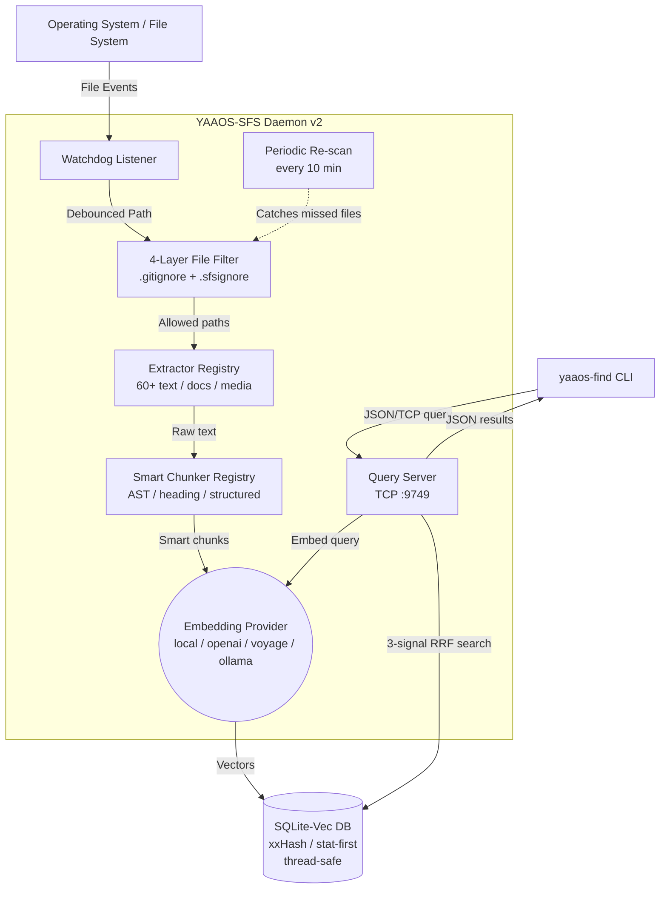
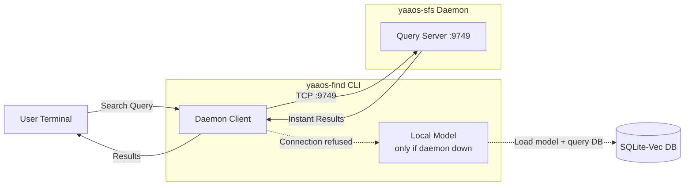

# YAAOS Semantic File System (SFS) v2 Architecture

The YAAOS Semantic File System is designed to be highly self-contained, lightweight, and entirely local by default. SFS v2 introduces multi-format support, smart chunking, enhanced search, and swappable embedding providers.

---

## High-Level Architecture

SFS consists of two main programs and a client-daemon IPC layer that connects them. All heavy dependencies (database, embedding model) are embedded within the daemon process — no external servers required.

### 1. The Core Programs

1. **The Daemon (`yaaos-sfs`)**
   - A long-running Python background process with an embedded TCP query server.
   - Run it once: `uv run yaaos-sfs` and leave it running in the background.
   - Performs an initial scan with aggressive 4-layer filtering.
   - Watches file system events via `watchdog` with debouncing (configurable, default 1.5s).
   - Runs periodic re-scans (every 10 minutes) to catch files the OS watcher may miss.
   - Hosts a TCP query server on `localhost:9749` for instant CLI searches.
   - When a file changes: extract text -> chunk intelligently -> embed -> save to DB.

2. **The Finder CLI (`yaaos-find`)**
   - A short-lived terminal command for semantic search.
   - Connects to the daemon via TCP for **instant** results (~50ms, no model loading).
   - Falls back to loading the model directly if the daemon isn't running.
   - Supports type filtering (`--type pdf,docx`), result count (`--top 20`), and status (`--status`).

3. **The IPC Layer (Client-Daemon Protocol)**
   - Length-prefixed JSON over TCP on `localhost:9749` (configurable via `query_port`).
   - Messages: `search` (query + top_k -> results), `status` (-> index stats + type breakdown), `ping` (-> health check).

---

## Module Architecture (v2)

```
yaaos_sfs/
|-- __init__.py          # Package + version
|-- config.py            # TOML-based configuration loading
|-- filter.py            # 4-layer file filtering pipeline
|-- db.py                # SQLite + sqlite-vec + FTS5 database layer
|-- daemon.py            # File watcher daemon with debouncing + batching
|-- server.py            # TCP query server (runs inside daemon)
|-- client.py            # TCP client (used by CLI)
|-- cli.py               # Click-based search CLI (yaaos-find)
|-- search.py            # 3-signal RRF hybrid search engine
|-- extractors/          # Text extraction registry (v2)
|   |-- __init__.py      # Registry: extension -> extractor function
|   |-- text.py          # Plain text + code (60+ extensions) + PDF
|   |-- documents.py     # DOCX, PPTX, XLSX, EPUB, RTF (optional deps)
|   |-- media.py         # Image EXIF, audio ID3, video metadata (optional deps)
|-- chunkers/            # Smart chunking registry (v2)
|   |-- __init__.py      # Registry: extension -> chunker, with fixed-size fallback
|   |-- code.py          # tree-sitter AST chunking (functions/classes as chunks)
|   |-- document.py      # Heading/section-aware prose chunking
|   |-- structured.py    # JSON/YAML/CSV key-value extraction
|-- providers/           # Embedding provider abstraction
    |-- __init__.py      # EmbeddingProvider ABC
    |-- local.py         # sentence-transformers (default, local)
    |-- openai_provider.py   # OpenAI API
    |-- voyage_provider.py   # Voyage AI API (best code embeddings)
    |-- ollama_provider.py   # Ollama local API (any model)
```

---

## Three-Tier File Processing Pipeline

```
File arrives
    |
    |-- Filter Pipeline (should we index this?)
    |   |-- Layer 1: Hardcoded dir skip list (.git, node_modules, __pycache__...)
    |   |-- Layer 2: .gitignore + .sfsignore matching (pathspec library)
    |   |-- Layer 3: Extension whitelist (from config)
    |   |-- Layer 4: Size limit (default 5MB, configurable)
    |
    |-- Tier 1: Text-native (direct read, 60+ extensions)
    |   Code: .py .js .ts .rs .go .c .java .rb .php .swift .kt .dart ...
    |   Markup: .md .txt .rst .html .xml .tex
    |   Config: .json .yaml .toml .ini .env .csv
    |
    |-- Tier 2: Rich documents (extract text, embed)
    |   .pdf    -> PyMuPDF
    |   .docx   -> python-docx (paragraphs, headings, tables)
    |   .pptx   -> python-pptx (slide text, speaker notes)
    |   .xlsx   -> openpyxl (sheet names, headers, values, capped at 1000 rows)
    |   .epub   -> ebooklib (chapters, HTML stripped)
    |   .rtf    -> striprtf
    |
    |-- Tier 3: Media metadata (extract tags, embed as text)
        Images: .png .jpg .gif .webp -> Pillow EXIF (camera, date, GPS, description)
        Audio: .mp3 .wav .flac .m4a  -> mutagen ID3 (title, artist, album, genre)
        Video: .mp4 .mkv .avi        -> mutagen (title, duration, codec)
```

Tier 2 and Tier 3 dependencies are **optional** -- install with `uv sync --extra docs`, `uv sync --extra media`, or `uv sync --extra all`.

---

## Smart Chunking Strategies

```
File type detected
    |
    |-- Code (.py, .js, .ts, .rs, etc.)
    |   tree-sitter AST -> extract functions/classes/methods
    |   Each symbol = 1 chunk, prefixed with file path + language
    |   Large symbols (>1024 tokens): sub-chunked with signature prefix
    |   Small symbols (<64 tokens): merged with neighbors
    |   Fallback: fixed-size word chunking if tree-sitter unavailable
    |
    |-- Documents (.md, .docx, .pdf, .txt)
    |   Section-aware: split on ## headings, page breaks, paragraphs
    |   Preserves heading context as chunk prefix
    |   Falls back to 512-word chunks with 50-word overlap
    |
    |-- Structured (.json, .yaml, .csv)
    |   JSON: flattened key.path: value lines
    |   YAML: parsed then flattened, or split on top-level keys
    |   CSV: rows grouped with header preserved per chunk
    |
    |-- Default: fixed-size 512-word chunks with 50-word overlap
```

---

## Search Engine: 3-Signal RRF Hybrid Search

The search engine fuses three independent signals using Reciprocal Rank Fusion (RRF):

1. **Vector similarity** -- `sqlite-vec` cosine distance against query embedding
2. **Keyword matching** -- FTS5 BM25 full-text search
3. **Path matching** -- fuzzy match of query terms against file paths

After fusion, a **recency boost** (1.0-1.1x multiplier) is applied to files modified within the last 7 days.

Results include `file_type` and `modified_at` metadata. Type filtering (`--type pdf,docx`) is applied post-search.

---

## Change Detection: Stat-First Approach

```
stat() -> compare (mtime_ns, size_bytes) stored in DB
  |-- Both match     -> SKIP (zero I/O, ~1us/file)
  |-- Size differs   -> CHANGED (re-index)
  |-- mtime differs, size same -> xxHash128 to confirm
      |-- Hash matches -> touch-only, skip
      |-- Hash differs -> re-index
```

**xxHash128**: 30-50 GB/s vs SHA-256 at 0.5 GB/s = **60-100x faster**.

---

## Provider Architecture (Swappable Embeddings)

```toml
# config.toml -- swap provider with one line
[embedding]
provider = "local"     # or "openai", "voyage", "ollama"
model = "all-MiniLM-L6-v2"

[providers.openai]
api_key_env = "OPENAI_API_KEY"

[providers.voyage]
api_key_env = "VOYAGE_API_KEY"

[providers.ollama]
base_url = "http://localhost:11434"
```

| Provider | Models | Dims | Where |
|----------|--------|------|-------|
| **local** (default) | all-MiniLM-L6-v2 | 384 | CPU/GPU, ~80MB |
| **openai** | text-embedding-3-small | 1536 | Cloud API |
| **voyage** | voyage-code-3 | 1024 | Cloud API (best for code) |
| **ollama** | nomic-embed-text, mxbai-embed-large | 768/1024 | Local Ollama server |

---

## Component Flow Diagrams

### SFS Daemon Flow


### Search CLI Flow


---

## Daemon Performance Characteristics

### For a 22GB Mixed Dev Folder

| Metric | SFS v1 (MVP) | SFS v2 |
|--------|------------|--------|
| Files to scan | ALL (~500K+) | ~25K after filtering |
| Files to index | ALL (~500K+) | ~20K text + ~2K docs + ~5K media |
| Initial index time | Would crash/hours | **3-5 minutes** |
| Incremental check | SHA-256 every file (~2 min) | Stat check: **<1 second** |
| DB size | N/A | ~150-250 MB |
| RAM usage (idle) | ~350 MB (model) | ~350 MB (unchanged) |
| Search latency | <200ms | <200ms (3-signal RRF) |
| File types supported | ~10 (text only) | **65+ (text + docs + media)** |
| Change detection | SHA-256 | xxHash128 (60-100x faster) |
| Burst handling | Each event separately | Debounce + batch embed |

---

## Scale Benchmarks (Real-World 21.5 GB Workspace)

| Metric | Size | File Count | Percentage |
| :--- | ---: | ---: | ---: |
| **Total Discovered Data** | 21.51 GB | 225,208 | 100.0% |
| **Ignored Data (Pruned)** | 21.46 GB | 222,139 | 99.8% |
| **Indexed Data** | 50.19 MB | 3,069 | 0.2% |

The 4-layer filter prunes **99.8%** of the workspace in ~4 seconds, leaving only ~50 MB of actual content to index.

---

## Future: OS Integration

When YAAOS ships as a Linux distribution:

1. **Systemd Service** -- SFS runs as `systemctl enable yaaos-sfs`, boots invisibly alongside the OS.
2. **Binary Compilation** -- Nuitka/PyInstaller for standalone executables with reduced overhead.
3. **IDE Integration** -- VS Code, terminals, and AI bots connect to `localhost:9749` for instant search.
4. **Rust Migration Path** -- `filter.py` -> Rust CLI, `db.py` -> rusqlite, `daemon.py` -> notify crate. Each swappable independently.
