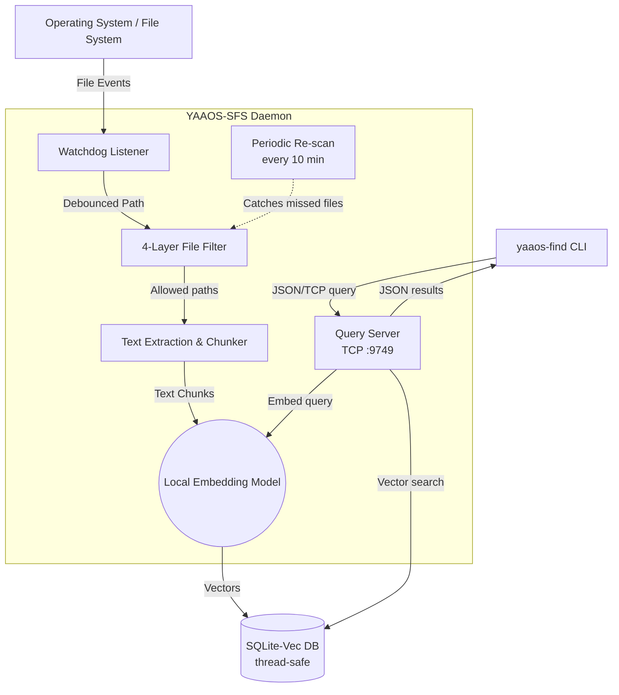
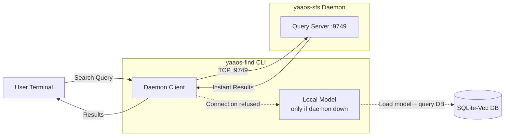

# YAAOS Semantic File System (SFS) Architecture

The YAAOS Semantic File System is designed to be highly self-contained, lightweight, and entirely local by default.

This document clarifies what components exist, where they run, and how they interact with each other.

---

## 🏗️ High-Level Architecture

SFS consists of two main programs and a client-daemon IPC layer that connects them. All heavy dependencies (database, embedding model) are embedded within the daemon process — no external servers required.

### 1. The Core Programs (The "What you run" part)

1. **The Daemon (`yaaos-sfs`)**
   - **What it is:** A long-running Python background process with an embedded TCP query server.
   - **When to invoke:** You run it once in a terminal using `uv run yaaos-sfs` and leave it running in the background.
   - **What it does:**
     - Performs an initial scan of your directory.
     - Listens to local file system events (Created, Modified, Deleted) using `watchdog` with debouncing.
     - Runs a **periodic re-scan** (every 10 minutes by default) to catch files the OS watcher may have missed (bulk copies, buffer overflows).
     - Hosts a **TCP query server** on `localhost:9749` so the CLI can search instantly without loading the model.
     - When a file changes, it extracts text, chunks it, embeds the chunks into vectors, and saves them to the database.

2. **The Finder CLI (`yaaos-find`)**
   - **What it is:** A short-lived terminal command.
   - **When to invoke:** You run it whenever you want to search your codebase. (e.g., `uv run yaaos-find "Where is the file filtering logic?"`).
   - **What it does:** It connects to the running daemon via TCP, sends your query, and gets back results **instantly** (no model loading). If the daemon isn't running, it gracefully falls back to loading the model directly.

3. **The IPC Layer (Client-Daemon Protocol)**
   - **Protocol:** Length-prefixed JSON over TCP on `localhost:9749` (configurable via `query_port`).
   - **Messages:** `search` (query + top_k → results), `status` (→ index stats), `ping` (→ health check).
   - **Why TCP:** Works on all platforms (Linux, WSL, Windows), simple to debug, and the overhead (~1ms roundtrip on localhost) is negligible compared to model loading (~1.5s).

---

### 2. The Core Technologies (The "Where does it run" part)

A common point of confusion is over things like the "Database" or the "AI Model". **In YAAOS SFS, everything is embedded locally in the daemon process.** There are *no* external standalone servers running on separate ports (other than the daemon's own TCP query server).

1. **The Database (`sqlite-vec`)**
   - **Where it runs:** Inside the daemon process. There is **no separate SQL server** (like PostgreSQL or MySQL) running in the background.
   - **How it works:** `sqlite-vec` acts exactly like standard SQLite but with vector math support. It reads and writes directly to a file stored locally on your disk (at `~/.local/share/yaaos/sfs.db`).
   - **Thread safety:** The database uses `check_same_thread=False` with a `threading.Lock` to safely handle concurrent access from the watchdog thread, debounce worker, periodic re-scan, and query server.
   - The CLI no longer needs to open the DB directly — it queries the daemon instead.

2. **The Local Embedding Model (`sentence-transformers`)**
   - **Where it runs:** Loaded **once** into the daemon's memory at startup. Downloaded to your local `.cache/huggingface` folder the first time you run YAAOS, then runs completely locally using your CPU (or GPU if configured).
   - **How it works:** The daemon holds the model in memory and uses it for both indexing and search queries. The CLI sends queries to the daemon over TCP, so **the model is never loaded twice**. If the daemon is not running, the CLI falls back to loading its own model instance (slower).
   - *Note: You can opt out of the local model by configuring the `openai` provider, which will send text over the network to OpenAI APIs instead.*

---

## 🗺️ Component Flow Diagrams

### SFS Daemon (Background Watcher + Query Server) Flow

### Search CLI Flow (Daemon Mode vs Fallback)

---

## 🔄 The Interaction Lifecycle (When everything happens)

Let's trace a practical example:

1. **Starting Up (& Restarting):** You run `uv run yaaos-sfs`.
   - The Python process starts.
   - It directly creates/opens the local SQLite file on your disk (thread-safe with `check_same_thread=False` + lock).
   - It loads the `sentence-transformers` embedding model into your machine's RAM.
   - It starts the **TCP query server** on `localhost:9749`, ready to serve search requests from the CLI.
   - **Incremental Re-indexing:** It runs an "Initial Scan" over your directory. Instead of re-embedding everything blind, it compares file modification times (`mtime_ns`) on the disk against the timestamps stored in the SQLite DB. SFS *only* chunks and embeds files that are **new** or have been **modified** since the daemon was last shut down. Files that haven't changed are instantly skipped (~1 microsecond per file).
   - It starts the **periodic re-scan timer** (every 10 minutes by default).
   - It begins actively watching your files via `watchdog`.

2. **Editing Code:** You edit `filter.py` and hit "Save".
   - The OS triggers a file-write event.
   - The `watchdog` inside the Daemon notices the change and pauses for 1.5 seconds (debouncing, in case you save multiple times in a row).
   - The Daemon reads `filter.py`, chunks the text.
   - The Daemon runs the text chunks through the Local Model in RAM to get vectors.
   - The Daemon saves those vectors into the SQLite DB file (thread-safe).

3. **Bulk Copy / Git Checkout:** You copy thousands of files or switch branches.
   - The OS event buffer may overflow, dropping some file events silently.
   - The **periodic re-scan** (every 10 minutes) walks the directory, detects the new/changed files via stat comparison, and indexes them automatically.
   - No manual intervention needed — the re-scan catches what the watcher missed.

4. **Searching:** In a separate terminal, you run `uv run yaaos-find "How does the filter work?"`
   - A *new* Python process spawns (the CLI).
   - It connects to the daemon's query server on `localhost:9749` via TCP.
   - The daemon embeds your query using the model already in memory, runs the hybrid search (vector + keyword + RRF fusion), and sends back results — all in **milliseconds**.
   - The CLI prints the results and exits. **No model was loaded.** Total time: ~50ms instead of ~2 seconds.
   - *Fallback:* If the daemon isn't running, the CLI loads the model directly (slower, ~2s first query) and searches the DB file on disk. Same results, just slower startup.

---

## 🐧 Future OS Integration (How will this work on YAAOS?)

When YAAOS ships as a full Linux distribution, you won't be manually starting SFS in a terminal. 

1. **Systemd Service:** SFS will run as a native background `systemd` service (`systemctl enable yaaos-sfs`). It will boot up invisibly alongside the Linux kernel/UI. The query server on `localhost:9749` will be immediately available for any application to search.
2. **Binary Compilation:** While written in Python, for the final OS release we will likely compile the application using tools like `Nuitka` or `PyInstaller`. This turns the Python scripts into heavily optimized standalone C/C++ executables, drastically reducing CPU/RAM overhead on the system compared to spinning up a virtual environment.
3. **IDE Integration:** Code editors (VS Code, etc.) and terminal AI bots will connect directly to the daemon's TCP query server (`localhost:9749`) for instant semantic search — no model loading, no CLI overhead. The JSON-over-TCP protocol makes integration trivial from any language.

---

## 📊 Scale & Resource Utilization Estimates (Real World Example)

*Individual folder metrics below are derived from real-world data using the `tools/stats/calc_stats_win.py` utility.*

To understand how aggressively SFS optimizes itself, let's look at a real-world scan of a **21.5 GB workspace** (containing 225,000 files):

| Metric | Size | File Count | Percentage |
| :--- | ---: | ---: | ---: |
| **Total Discovered Data** | 21.51 GB | 225,208 | 100.0% |
| **Ignored Data (Pruned)** | 21.46 GB | 222,139 | 99.8% |
| **Indexed Data** | 50.19 MB | 3,069 | 0.2% |

### 1. Phase 1: Pruning the Noise (The Filter)
- **Time:** Blazing Fast (4 seconds).
- **RAM:** Nominal (<50 MB).
- **What Happens:** The 4-layer Python filter instantly identifies that **99.8% of the workspace** is noise (`.git`, `node_modules`, binaries) and skips it entirely. Out of 21.5 GB, only **50 MB** of actual text source code survives. 

### 2. Phase 2: Indexing the Source Code
- **Time:** Fast (Minutes). Embedding 50 MB of text requires breaking it down into roughly 100,000 chunks. On a CPU this takes a few minutes. On a GPU it takes seconds.
- **RAM:** Moderate (~1GB to 2.5GB). The Daemon holds the local `sentence-transformers` model in memory.
- **CPU:** High (Pegged at 100% on the worker thread).
- **What Happens:** The 50 MB of text is sequentially chunked and fed into the active embedding model.

### 3. Phase 3: The SQLite Database Storage
- **Size:** Large initially, constant afterward. 
- **The Math:** An embedded vector (384-dimensional floating-point array for standard MiniLM) is roughly `1.5KB`. Because of the background HNSW graph architecture that allows "instant" nearest-neighbor searches, the database size inflates to about 7x the size of the raw payload text.
- **Final Result:** Our **50 MB** of pure text will grow to an roughly **~350 MB** SQLite database file. 

### 4. Phase 4: Idle Watchdog State
- **Time:** Instant.
- **RAM:** Constant (~1GB for the daemon holding the model in memory).
- **CPU:** 0% (Idle).
- **What Happens:** Once caught up, the daemon rests completely. It uses zero CPU, sitting quietly waiting for an OS file-write event. SQLite costs zero idle memory.

### 5. Phase 5: Executing a Search (`yaaos-find`)
- **Time (daemon running):** Instant (~50ms). The CLI sends a TCP request to the daemon, which already has the model in memory.
- **Time (daemon not running):** ~2 seconds. The CLI falls back to loading its own model instance.
- **RAM (daemon running):** Negligible. The CLI is just a thin TCP client — no model loaded.
- **RAM (daemon not running):** High temporarily (~1GB to 2.5GB) for loading `sentence-transformers`.
- **CPU:** Minimal. The daemon embeds the tiny search query and runs a fast vectorized dot-product search via `sqlite-vec`.
- **Disk I/O:** Moderate burst. The database does a rapid nearest-neighbor lookup across the indexed vectors.
- **What Happens:** The CLI connects to daemon on `localhost:9749`, gets results, prints them, and exits. If daemon is down, it loads the model, queries the DB directly, then exits.
